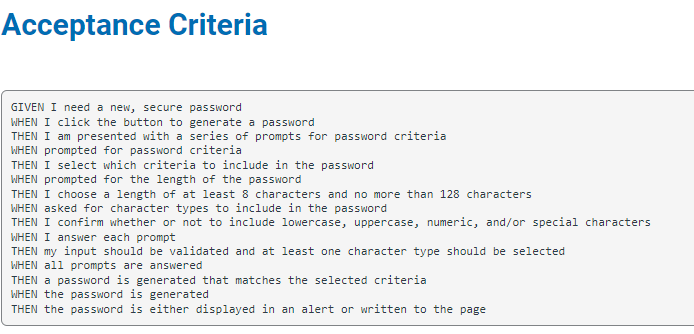
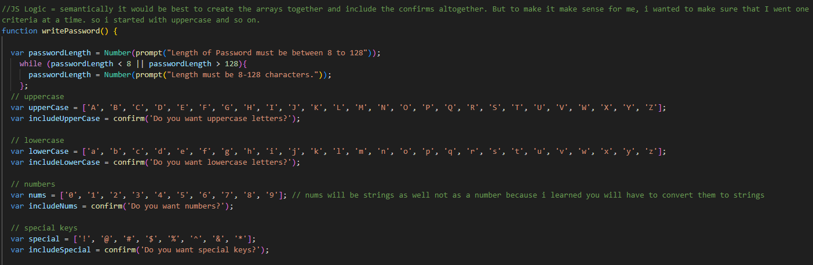
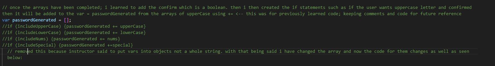
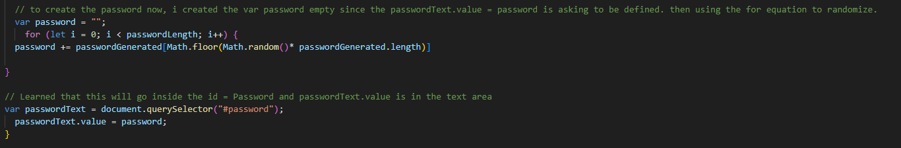

# Password Generator Starter Code

## JavaScript Assignment Module 3
This challenge requires us to create a random password generator based upon acceptance criterias provided.  
We are to provide strong password that meets certain criterias and one that provides security.  
 
 
## ACCEPTANCE CRITERIA
  

Given a starter code that has HTML and CSS, the only thing that we need to provide were the JavaScript functions.  
Given the idea to begin only with the functions, I wanted to take things easily and start off with what I am able to do  
That is create the variables:  

I learned using `while` through Stack Overflow and how we can use this function for the length of the password. `var passwordLength` was created based off that idea that length must come first in the function that I am writing. Password must be between 8 and 128 characters. `Number(prompt())` was the next thing I learned since we are asking the user to write how many characters they would want in their password. While Number will create the written value from a string to a number which is important that the user writes a number.  
Next is to create the `var upperCase, lowerCase, nums, special` along with the confirm (which i learned created a dialogue box that returns a boolean value) statements with `var includeUpperCase,` and so on.   
 
 
## Condition Statements
Now to create the password from the variables, I learned this below:  
  
I have stated why I removed these if statements because they simply did not work with the changed array.  
Initially, I had my objects in 1 full string i.e. `ABCDEFGHIJKLMNOPQRSTUVWXYZ`, but my instructor advised me to put them separate from one another.  
As you may see, I have added a comma after each object which is unfortunate given the condition statements included the commas in my generated password. I then changed my statements to  
`if (includeUpperCase) {passwordGenerated = passwordGenerated.concat(upperCase);}`  
`if (includeLowerCase) {passwordGenerated = passwordGenerated.concat(lowerCase);}`  
`if (includeNums) {passwordGenerated = passwordGenerated.concat(nums);} `  
`if (includeSpecial) {passwordGenerated = passwordGenerated.concat(special);}`  
to ensure that if in the confirm statement of the include var is `true` then within the `var passwordGenerated` will concat the objects in each created arrays without the commas and that worked for my code. Also I realized that since my objects were in `[]` then my `var passwordGenerated` must be in `[]` as well. That stored the strings better within. 
 
 
## Randomizing the generator
  
In order to randomize the generator, i learned in class how to randomize the variables and the objects stored in them through `Math.floor(Math.random())` then multiplied by the length of each string in the `var passwordGenerate`. I learned that I should first place it in an var preferably call it a `randomIndex` but thought there might be a shorter way of doing so. That is how I found out about the `+=` operator which concatenates and combines values. So my thought process was to randomize the ojects then they must go inside the var created `var password "";`

Deployed site: 

